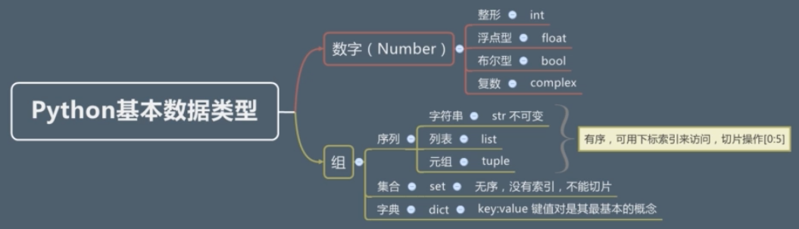

# Python数据类型




## 一、Number 数字

### （一）类型

正数：int；浮点数：float；判断数据类型：type(obj)

### （二）计算

1+0.1 => 1.1 => float

1+1.0 => 2.0 => float

1*1.0 => 1.0 => float

type(1/2) => 0.5 => float

type(1//2) => 0 => int => 整除(保留正数部分)

### （三）进制

1.表示方式：

二进制(0b)：0b11 => 3

八进制(0o)：0o11 => 9

十六进制(0x)：0x1f => 31

2.进制转换

转换函数内可以放不同进制类型数字

转化成二进制：`bin()`

转换成十进制：`int()`

转换成八进制：`oct()`

转换成十六进制：`hex()`


## 二、 序列（不是python数据类型）

1.序列包括：str; list; tuple

2.序号：[]取值，每一个元素都有一个序号

3.切片：`list[i:j:d]` 取值，从第 i 位取到第 j-1 位，步长为d

4.可以进行“+/*”操作

5.通过in/not in判断元素是否在序列中

6.查看序列长度：`len()`

7.查看最大/最小元素：`max()` / `min()`


## 三、Str 字符串

#### （一）表示方式

1.单引号、双引号

引号成对出现，引号中间可以有不同类型引号

```python
"let's go"
'let\'s go'
```

单引号/双引号换行：

```python
"hello\
world"
#输出：helloworld
```

2.三引号

三引号内不字符串可以换行(添加\n)，三个单引号或三个双引号都可以

```python
'''
python
python
python
'''

"""
python
python
python
"""
```

### （二）转义字符

作用：表示无法“看见“的字符、与语言本身有冲突的字符

`\n`：换行

`\'`：单引号

`\t`：横向制表符

`\n`：换行

`\t`：回车

### （三）输出原始字符串

在字符串引号前加'r'

```python
print(r"c:\n1\n2\n3")
#原封不动输出字符串内容，不然\n会换行
```

### （四）字符串运算

```python
1.加法："hello"+"world" => "helloworld"
2.乘法："hello"*3 => "hellohellohello"
3.下标：
	(1)正数："hello"[2] => e
	(2)负数："hello"[-4] => e #步长，从字符串最后往回数
  (3)范围："hello"[2:4] => ll #从起始数字开始，读取到终止数字前一位
4.查看ASCLL码：ord()
```


## 四、list 列表

### （一）定义/访问

1.定义：`[1, 2, 3, 4, 5]`

2.列表内对数据类型无要求：`[1, "str", True, [1, 2, 3]]`

3.访问列表内元素：`list[1]`、`list[-2]`

4.切片操作同样返回一个列表：`list[1:3]`

### （二）列表操作

```python
1.加法：[1,2]+[3,4] => [1,2,3,4]
2.乘法：[1]*3 => [1,1,1]
```


## 五、tuple 元组

与列表类似，用圆括号定义，如：

```python
(1, "str", True, (1,2,3) )
```

若圆括号内只有一个元素，则不表示元组，python解析为优先级运算：

```ptyhon
type((1)) => <class 'int'>
```

定义只有一个元素的元组：在单一元素后加括号

```python
type((1,)) => <class 'tuple'>
```

定义一个空的元组：一个空的圆括号

```python
type(()) => <class 'tuple'>
```


## 六、set 集合

### （一）定义

1.花括号：`{1,2,3,4,5}`

2.定义空集合：`set()`

### （二）特点

1.无序，不能[]取值，不能进行切片操作

2.不重复：`{1,1,2,2,3,3,4}` ===转换===> `{1,2,3}`

### （三）操作

1.判断长度：`len()`

2.判断知否存在：`in` / `not in`

3.求差集：`{1,2,3,4,5} - {2,3}` ==> `{1,4,5}`

4.求交集：`{1,2,3,4,5} & {2,3}` ==> `{2,3}`

5.求并集：`{1,2,3,4,5} | {5,6}` ==> `{1,2,3,4,5,6}`


## 七、dict 字典

1.花括号定义：`{key1 : value1, key2 : value2...}`，同JavaScript中Json对象

2.定义空的字典：`{}`

3.注意：

​	不能有重复的key

​	key必须为不可变的类型：int; str

​	value可为任意类型：str; int; float; list; set; list...

4.取值：`dict["key"]`


## 八、枚举

python中的创建枚举类型需引入标准库中 `enum` 模块

继承 `Enum` 类可创建一个枚举对象，继承 `IngEnum` 模块则枚举的值只能为数字

特点：常量、不可重复、不可更改

**枚举的三个特征**

枚举类型：`Enum.VALUE`，类型为 `<enum 'Color'>`

枚举的名字：`Enum.VALUE.value`，不可重复

枚举的值：`Enum.VALUE.name`，若枚举中存在两个值相同的类型，则第二个会被当作第一个的别名

```python
from enum import Enum
class Color(Enum):
    RED = 1
    GREEN = 2
    BLUE = 3
print(Color.RED, Color.RED.name, Color.RED.value)
# Color.RED 1 RED
```

**自动设定枚举的值：**

```python
from enum import Enum, auto
class Color(Enum):
    RED = auto()
    GREEN = auto()
    BLUE = auto()
print(Color.BLUE, Color.BLUE.name, Color.BLUE.value)
# Color.BLUE BLUE 3
```

**遍历**

可通过 `Enum.__members__` 遍历重名枚举元素

```python
from enum import Enum
class Color(Enum):
    RED = 1
    GREEN = 1
    BLUE = 2

for item in Color:
    print(item, end=" | ")
# Color.RED | Color.BLUE |

for item in Color.__members__:
    print(item, type(item),  end=" | ")
# RED <class 'str'> | GREEN <class 'str'> | BLUE <class 'str'> | 

print(type(Color.__members__))
# <class 'mappingproxy'>
```

**通过值寻找枚举元素**

```python
from enum import Enum
class Color(Enum):
    RED = 1
    GREEN = 2
    BLUE = 3
print(Color(2))
# Color.GREEN
```

**unique装饰器**

引入unique装饰器则枚举的值不能重复

```python
from enum import Enum, unique
@unique
class Color(Enum):
    RED = 1
    GREEN = 1
    BLUE = 2
# 报错：ValueError: duplicate values found in <enum 'Color1'>: GREEN -> RED
```

